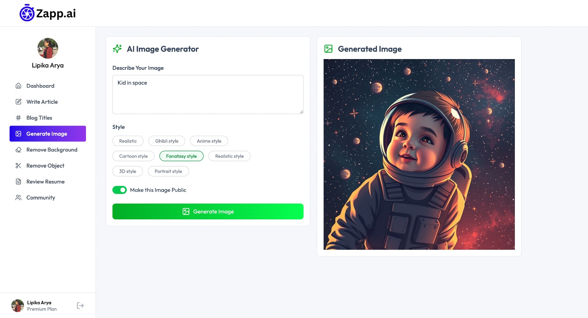
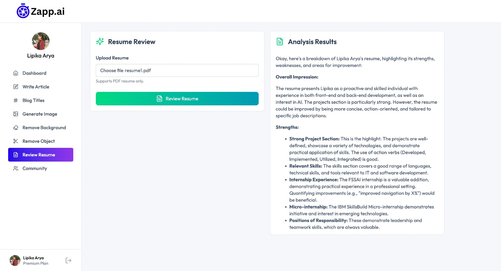

# ⚡ Zapp.ai - AI SaaS App

**ZAPP-AI** is a powerful AI SaaS application that offers a suite of AI-driven tools to streamline your content and image workflows — from article and blog generation to resume reviews and image manipulation. Built with **React**, **Node.js**, **Clerk**, and **Gemini API**, it combines performance with simplicity.


## 💻 Deployed App

👉 [Try it live!](https://zapp-ai-zeta.vercel.app/)

## 📸 Preview

### 📌 Landing Page


### 📌 Generate Image Page


### 📌 Resume Review Page


## 🛠️ Tech Stack

- **Frontend:** React, Tailwind CSS
- **Backend:** Node.js, Express
- **Authentication:** Clerk
- **Database:** PostgreSQL via Neon DB
- **File Uploads:** Multer
- **Image Hosting:** Cloudinary
- **AI Features:** Gemini API (from Google)
               


## ✨ Features

- 🧠 **Write Articles** – Generate long-form articles using AI
- 📝 **Generate Blog Titles** – Instantly get AI-generated catchy titles
- 🖼️ **Generate Images** – Create AI-powered images from prompts
- 🪄 **Remove Image Backgrounds** – One-click background removal
- 🎯 **Remove Image Objects** – Select and erase objects from images
- 📄 **Resume Review** – Get smart feedback and insights on your resume
- 💳 **Subscription Management** – Unlock premium AI features with secure Clerk-managed subscriptions


## 📦 Installation Guide

### ✅ Prerequisites

Before getting started, ensure you have the following installed:

- **Node.js** (v18 or later) – [Download](https://nodejs.org/)
- **npm** or **yarn**
- **Git** – [Download](https://git-scm.com/)
- **Clerk account** – [Create one](https://clerk.dev/)
- **Cloudinary account** – [Create one](https://cloudinary.com/)
- **Gemini API access** – [Set up here](https://ai.google.dev/)
- **Neon DB account** – [Set up here](https://neon.tech/)
```

### ⚙️ Clone the Repository

```bash
git clone https://github.com/lipika1911/ZappAI.git
cd ZappAI
```

### 🔌 Install Dependencies

```bash
npm install
```

### 📝 Environment Variables

Create a .env file in client and server folders and configure the following:

**Client**
```env
VITE_CLERK_PUBLISHABLE_KEY = your_clerk_publishable_key
VITE_BASE_URL = your_vite_base_url
```

**Server**
```env
DATABASE_URL = your_neon_db_url
CLERK_PUBLISHABLE_KEY = your_clerk_publishable_key
CLERK_SECRET_KEY = your_clerk_secret
GEMINI_API_KEY=your_gemini_api_key
CLIPDROP_API_KEY = your_clipdrop_api_key
CLOUDINARY_CLOUD_NAME=your_cloud_name
CLOUDINARY_API_KEY=your_api_key
CLOUDINARY_API_SECRET=your_api_secret
```

### 🏃 Run Backend

```bash
cd server
npm start
```

### 🏃 Run Frontend

```bash
cd client
npm run dev
```

### ✅ You’re all set!
- Open http://localhost:5173 in your browser.
- Register a new user and start using ZappAI!
## 📬 Contact

For feedback, ideas, or collaborations, reach out:

- 💻 **GitHub:** [lipika1911](https://github.com/lipika1911)

## 📄 License

This project is licensed under the [MIT License](./LICENSE).


## 👩‍💻 About the Developer

Made with ❤️ by [Lipika](https://github.com/lipika1911)
